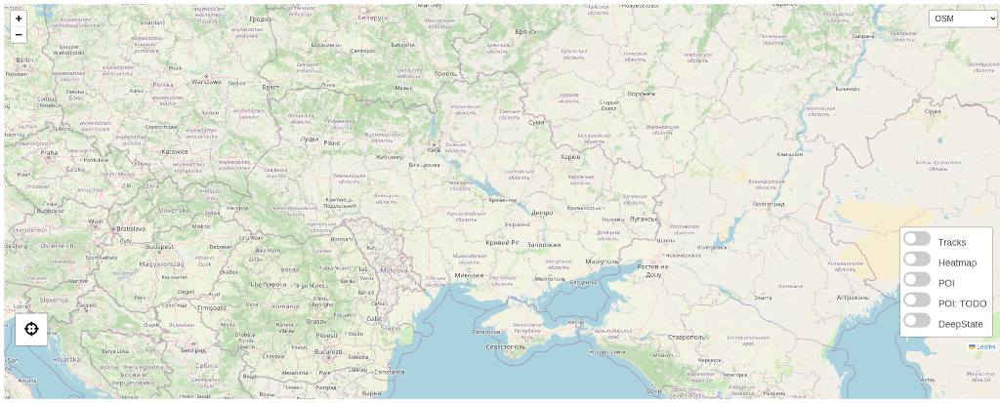
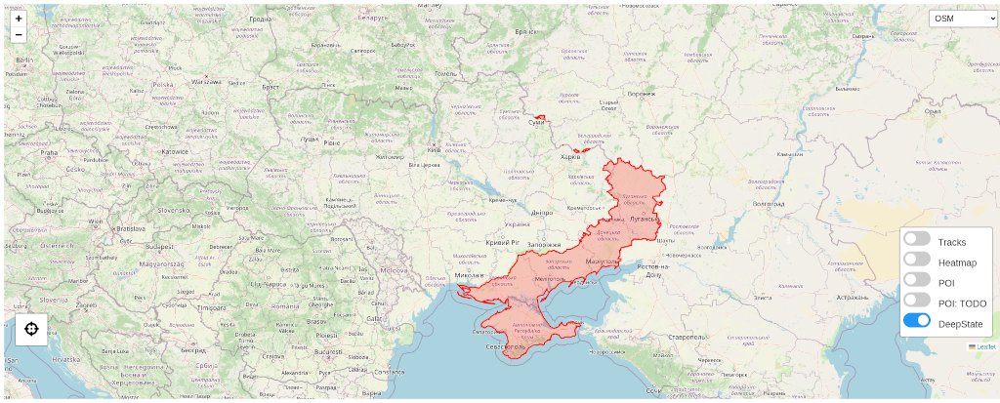

# GPXMap

An interactive GPX map viewer for displaying tracks, custom waypoints (POIs), heatmaps and DeepState polygon overlays.  
Supports map layer toggling, heatmap control, basemap switching (OSM / ArcGIS), and geolocation.

---

## Screenshots:

<table>
  <tr>
    <td></td>
    <td></td>
    <td></td>
  </tr>
  <tr>
    <td></td>
    <td></td>
    <td></td>
  </tr>
</table>

---

## Installation

python3 -m venv venv
source venv/bin/activate
pip install -r requirements.txt

---

## Usage

mkdir tracks; cp path/to/tracks/*.gpx tracks
OR
ln -s path/to/tracks/ tracks

./gen.py --html --geodata

Place index.html and geo_data.json.gz in docroot on webserver

Create vhost, add this location in vhost:

location ~ geo_data.json.gz {
    gzip off;
    add_header Content-Encoding gzip;
    add_header Content-Type application/json;
}

???????
PROFIT
